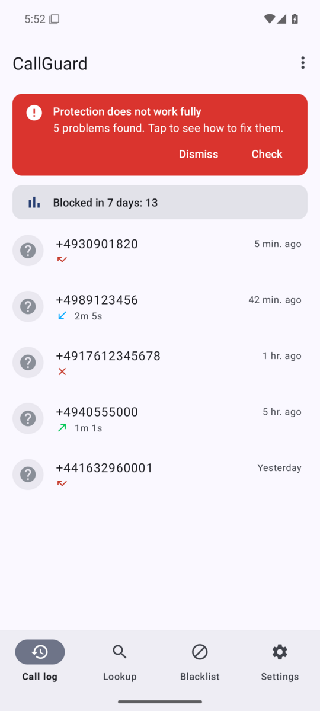
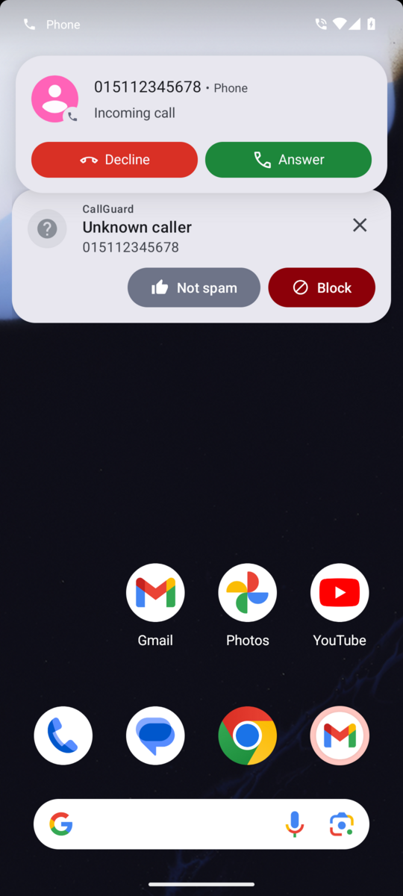
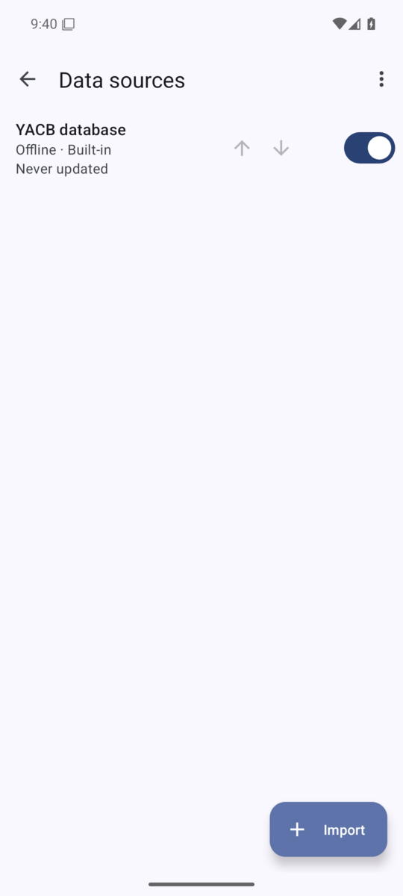
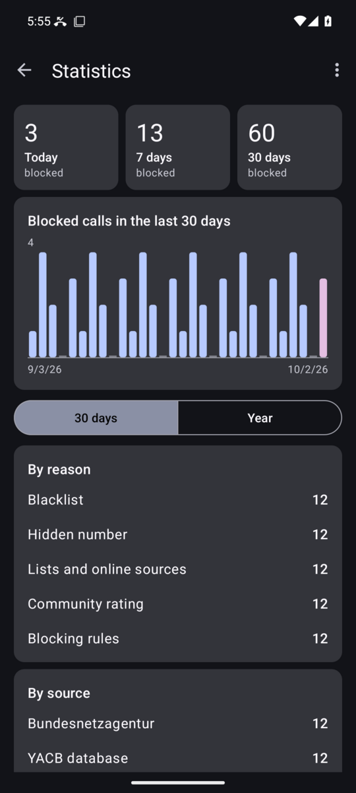

# CallGuard

**Free and open source spam call blocker for Android.** CallGuard identifies and blocks unwanted calls using several community and official databases, works offline, and keeps your data on your phone.

CallGuard is a fork of [Yet Another Call Blocker](https://gitlab.com/xynngh/YetAnotherCallBlocker) by **xynngh** (last release 0.5.17, 2021), rebuilt for current Android with a Material 3 interface and new data sources — with a focus on Germany.

[Русская версия](README.ru.md) · [Changelog](https://github.com/itmanpapa/Call/releases) · [License: AGPL-3.0-only](LICENSE)

<p>




</p>

## Features

- **Blocks spam before it rings** — uses Android's Call Screening role (Android 10+).
- **Several databases, checked offline:**
  - YACB community database (international, delta updates),
  - [PhoneBlock](https://phoneblock.net) — free German community list (free API key),
  - official list of the [Bundesnetzagentur](https://www.bundesnetzagentur.de/massnahmenliste) (downloaded automatically),
  - your own lists: CSV, Fritz!Box phone book XML, vCard — from a file or a URL with auto-update.
- **Caller-ID card** over the incoming-call screen: rating, category, source, "Block" / "Not spam".
- **Your own marks** ("spam" / "not spam") override every database; optionally reported to PhoneBlock.
- **Blocking rules:** number patterns (`+44*`, `0900*`), hidden numbers, foreign numbers, premium-rate numbers, schedules, "let a repeated call through".
- **Blacklist** with wildcards, swipe-to-block in the call log.
- **Spam SMS warnings** (optional): warns about SMS from numbers known as spam.
- **Setup check** — tells you exactly what prevents protection from working and how to fix it.
- **Statistics** and **backup / restore** of all settings and lists.
- **Material 3** design with dynamic colors and dark theme, **27 languages**, in-app language picker.
- **In-app updates** from GitHub Releases (GitHub build only).

## Install

Download the latest `callguard-vX.Y.Z.apk` from **[Releases](https://github.com/itmanpapa/Call/releases/latest)** and install it. Android 8.0 or newer is required. Afterwards CallGuard notifies you about new versions itself.

After the first start open **Settings → Setup check** and fix everything marked red (call screening role, permissions, blocking options).

F-Droid / IzzyOnDroid: in preparation.

## Privacy

- All lookups for incoming calls are done **offline** against downloaded databases.
- Optional online checks (PhoneBlock) send only a **SHA-1 hash** of the number.
- No analytics, no ads, no tracking.
- Network services used: YACB/"Should I Answer" database updates and reviews, PhoneBlock (with your own key), Bundesnetzagentur website, GitHub (update check). Some of these services are not free software.

## Support the project

If CallGuard is useful to you, you can buy me a coffee ☕ — the link will appear here and in *Settings → About*.

## Development

```
./gradlew assembleGithubDebug     # or assembleDebug before flavors are introduced
./gradlew testGithubDebugUnitTest
```

Requires JDK 17+ and Android SDK platform 36.

- CI (`.github/workflows/build.yml`) builds, runs unit tests, lint and a translation check on every push.
- `.github/workflows/screenshots.yml` runs the app on an emulator and stores screenshots in `docs/screenshots`.
- Releases: run **Actions → Release → Run workflow** on `main`. The version is taken from `versionName` in `app/build.gradle`; the workflow creates the tag and the release and attaches the signed APK. Signing keys are stored in repository secrets (`SIGNING_KEYSTORE_BASE64`, `SIGNING_KEYSTORE_PASSWORD`, `SIGNING_KEY_ALIAS`, `SIGNING_KEY_PASSWORD`).
- Manual test checklist: [docs/TESTING.md](docs/TESTING.md).

## Credits

- [Yet Another Call Blocker](https://gitlab.com/xynngh/YetAnotherCallBlocker) by xynngh — the original app; its full commit history is preserved here.
- [PhoneBlock](https://phoneblock.net) ([haumacher/phoneblock](https://github.com/haumacher/phoneblock)) and its community.
- Bundesnetzagentur — public list of measures against number misuse.

This project is not affiliated with any of the services it uses.

## License

[AGPL-3.0-only](LICENSE), like the original project.
